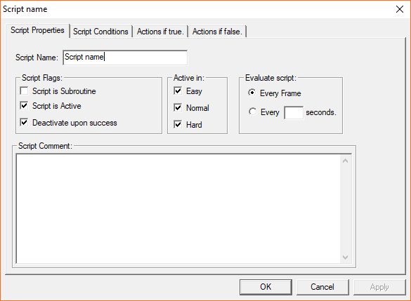
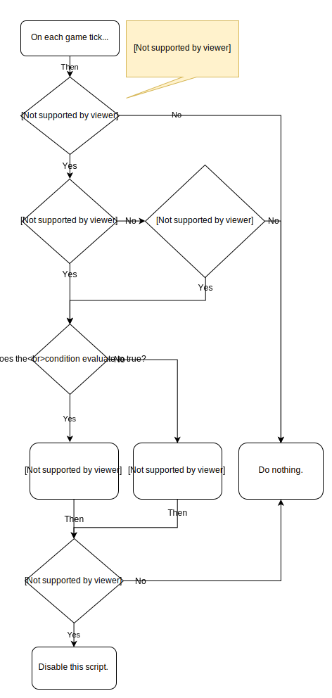
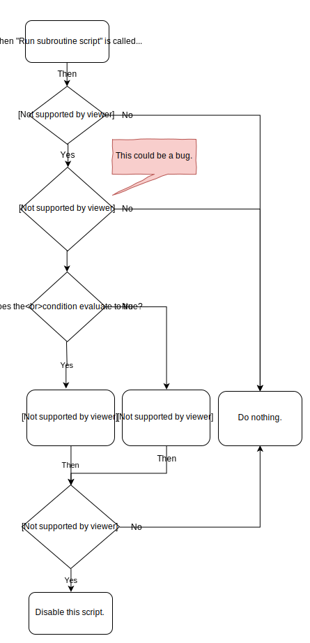
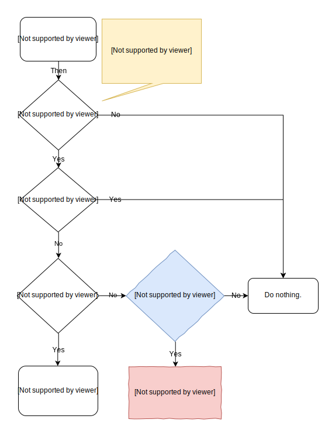
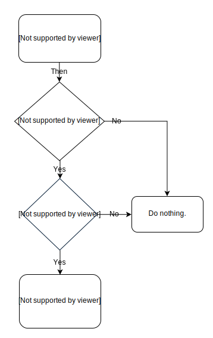
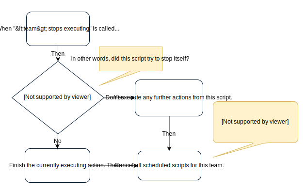

Scripting
=========

.. note:: This document describes how the scripting system works in Command & Conquer: Generals - Zero Hour.
          Some details can be different in newer SAGE titles, and some features are not covered at all.

SAGE has a built-in scripting system, which is used for scripted sequences, cinematics and AI.
Scripts are usually embedded within ``.map`` files, but they can also be stored in ``.scb`` files.

The scripting language is fairly high level, but at the same time it's rather limited in terms of features since it has been specialised for RTS game scripting.
It is written using the graphical editor included in WorldBuilder.

The following information is based on black box testing done with World Builder and Zero Hour, along with the official manuals for various versions of WorldBuilder.

Basics
------

The game expects the scripting system to run at about 30hz at all times.
Some options and actions refer to *frames*, which means game update cycles and not actual rendered frames. 
(This is because - unfortunately enough - SAGE has a 30fps frame limit by default, and the game speed is tied to the framerate.)

A script consists of the following parts:

- Properties
  
  - Name
  
  - Is active
    
    - A boolean flag which enables or disables the script.
    
  - Deactivate upon success
    
    - If the script is executed succesfully and this flag is set, the script will disable itself.
    
  - Is subroutine
    
    - Changes how the script is triggered. See `Subroutines`_.

  - Active in ``<difficulty level>``

  - Execution frequency ("Evaluate script" in WorldBuilder)

    - Every frame

    - Every ``<number>`` seconds

      - The script will run on the first frame it can run, and then every ``<number>`` seconds.

      - Disabling and re-enabling the script will not reset the interval timer.

- Conditions
  
  - Conditions are predicate functions which query the game state and return a boolean value.
    For example, they can check flags and counters, which units or technologies each player has, and so on.

  - They are combined into a single value with the AND operation - in other words, the value of the condition is true only if every subcondition is true.
    OR operations can be added manually.

- Actions

  - Actions are commands which modify the game state. They can do a lot of different things, like spawn units, modify variables and run `Subroutines`_ and `Sequential scripts`_.
  
  - Every script has an *if true* and an *if false* section, which is a list of actions. Which section gets run depends on the value of the condition variable.

  - Actions *that take longer than a frame* will not block other actions from starting.
    They are started in a sequential order during the same frame, and executed to completion in parallel.

Scripts are executed in the order defined in WorldBuilder. Conditions are only checked once per script per frame.
In practise this means that if a script has a set of conditions which are fulfilled during the same frame by an another script,
the script will only be executed if it's positioned after the other script.

If a script is disabled during execution (using the "Disable script" -action), it will still run to completion.

See the graph below for a compact description of how the script evaluation cycle works.

It should be noted that `Sequential scripts`_ work very differently from normal scripts, and a lot of this information doesn't apply to them.

Flags, counters and timers
--------------------------

The scripting system supports three kinds of variables:

- Flags

  - Flags are boolean variables, which can be toggled on and off.

  - Generals and Zero Hour have about two dozen global flags, which are only used to make the shell map react to the main menu.

- Counters

  - Counters are 32-bit signed integer variables, which can be modified and compared in various ways.

  - They overflow and underflow.

- Timers

  - Timers are automatically decrementing counters with a configurable starting value.

  - Timers tick down towards zero, and stay at ``-1`` when they expire.

  - All counter actions can be used on timers and vice versa.

  - The scripting system has separate actions for creating second timers and frame timers, but internally there's no difference.

  - The remaining time is stored as the number of remaining frames.

    - This means that the smallest unit of time that can be measured with a timer is one frame (~33 milliseconds).

Subroutines
-----------

Like most other programming languages, map scripts support subroutines.
They are created just like any other script, except they are explicitly marked as subroutines with the "Is subroutine" -checkbox.

Unlike normal scripts, subroutines are never executed automatically.
Instead, they are started from other scripts with the "Run subroutine script" action. Conditions are checked on each call.
They cannot take arguments, so data must be passed via global variables.

Testing has shown that if a subroutine's execution frequency is set to anything other than "Every frame", calling the subroutine will not do anything.
There's no simple logical explanation for this, so it could be a bug in the engine.

Sequential scripts
------------------

On the surface sequential scripts seem very similar to normal scripts - in fact, they are just normal scripts and they don't even have a specific configuration property like subroutines (until later SAGE games).
However, sequential scripts are executed very differently from other scripts:

- As the name implies, actions are run sequentially from top to bottom, during multiple frames if necessary.
  If an action takes multiple frames to execute, actions below it will wait until it's done.

- Like subroutines, sequential scripts have to be started manually.
  A sequential script is not necessarily started immediately, but instead queued for later execution.

- A sequential script is always associated with a *team*.
  This is presumably because they were primarily intended for AI programming.

  - Every team has an *execution queue*, which contains all scripted and player-issued commands for the team.
    The queue is shared by all units in the team, so if any unit is performing a task (such as moving and guarding) no scripted actions will be taken from the queue.

  - If the team has no units or buildings, the script will not be queued and therefore will not execute even if some units are added to the team later.

  - The team is bound to an implicit variable, named ``<this team>`` in WorldBuilder, which can be used in actions that take a team.
    
    - If ``<this team>`` is used outside of a sequential script, it will be effectively ``null`` and actions that try to use it do nothing.

    - The variable is **not** automatically propagated in subroutine calls.

  - A team can only run one sequential script at a time.

  - A sequential script can be run by multiple teams at the same time.

- Sequential scripts can be run in a loop.

- Sequential scripts can be stopped with an action.
  
  - If a sequential script stops itself, it will stop executing further actions immediately.

  - If a sequential script is stopped by an another script, it will finish the currently executing action and then stop.

  - Both cases also clear the team's execution queue of all *scripted* commands. Player-issued commands are not removed.

- "Is active" has no effect.

- "Is subroutine" has no effect.

- "Deactivate upon success" does nothing.

- Conditions are never checked.

Sequential scripts seem to have the same execution frequency bug as subroutines do. These seems to be a sequential script specific engine bug as well:
If a sequential script is queued for a team that has no units, it normally does nothing.
However, if that team is the player's default team (named ``teamplayer001``, ``teamplayer002``, ...) it will execute the first action of the script and then do nothing until the team gets some units.

Edge cases and trivia
---------------------

- If a sequential script is performing a "move to waypoint" -action and the player can control the unit(s), they can change the target location without interrupting the rest of the actions.
  The script continues normally after the unit(s) stop moving.
  
  - If the player queues multiple movement targets (with Alt+Click), the actions will continue when the unit(s) have gone through every target.
